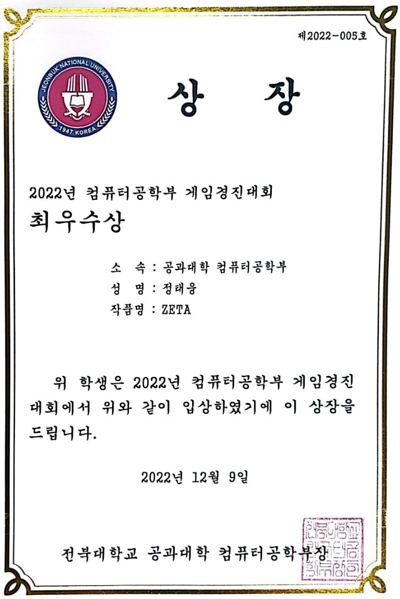
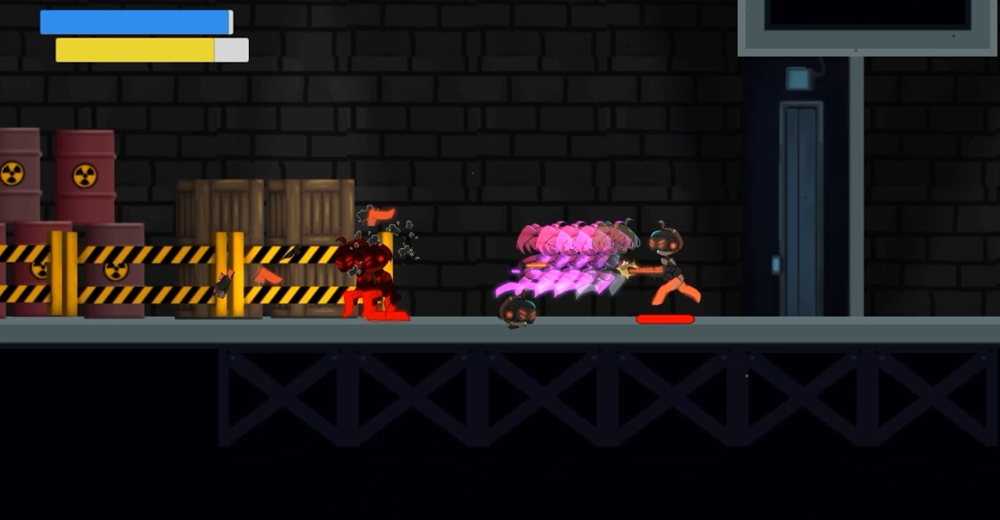
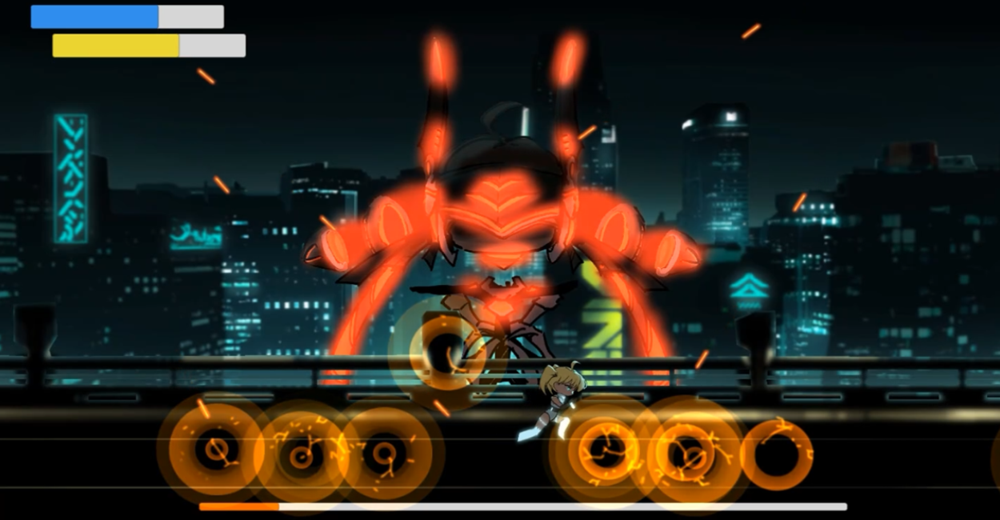

※ ZETA 프로젝트의 Prototype 버전입니다.

## 개요
<table>
  <tr>
    <td>
      <table>
        <tr><td><strong>기간</strong></td><td>2022.11 ~ 2022.12</td></tr>
        <tr><td><strong>인원</strong></td><td>1인 개발</td></tr>
        <tr><td><strong>역할</strong></td><td>클라이언트</td></tr>
        <tr><td><strong>도구</strong></td><td>UNITY, C#</td></tr>
        <tr><td><strong>타겟 기기</strong></td><td>PC</td></tr>
        <tr><td><strong>참여 활동</strong></td><td>2022 컴퓨터공학부 게임경진대회(최우수상)</td></tr>
      </table>
    </td>
    <td style="vertical-align: top; padding-left: 20px;">
      
    </td>
  </tr>
</table>

## 프로젝트 소개
Unity 기반으로 제작된 프로젝트이며, 대회 참가를 목적으로 제작되었습니다. 

2D 플랫포머 게임의 기본 구조를 직접 구현하는 데에 중점을 두었습니다.

이후, 해당 프로젝트를 기반으로 ZETA 프로젝트로 확장 및 발전하였습니다.

## 인게임 사진

  
  &nbsp;
  

## 관련 링크
<table>
  <tr><td>시연 영상</td><td><a href="https://youtu.be/33akfM7NdyE">바로가기</a></td></tr>
  <tr><td>ZETA 깃 허브</td><td><a href="https://github.com/JeongTaeWoong99/ZETA">바로가기</a></td></tr>
</table>
